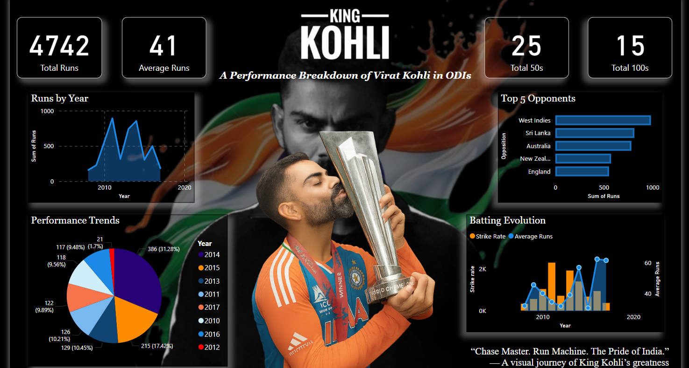

# 🏏 Virat Kohli ODI Dashboard – Power BI

This Power BI dashboard visualizes the One Day International (ODI) performance of Indian cricketer **Virat Kohli**. It provides interactive insights into his runs, centuries, match locations, and career trends.

---

## 📊 Features

- 🧮 Total Runs, 50s, 100s, and Average
- 📅 Year-wise Run Progression
- 🆚 Performance Against Top 5 Opponents
- 📈 Batting Evolution: Strike Rate vs Average Runs
- 🥇 Highlighted Centuries and Fifties by Year
- 📊 Pie Chart Showing Year-wise Contributions

---

## 📷 Dashboard Preview

> “**Chase Master. Run Machine. The Pride of India.**”  
> _– A visual journey of King Kohli’s greatness in ODIs._

---

## 📁 Files Included

| File | Description |
|------|-------------|
| `ViratKohli_ODI.pbix` | Power BI dashboard file |
| `dashboard.png` | Dashboard screenshot |

---

## 🛠 Tools Used

- **Power BI Desktop**
- **DAX (Data Analysis Expressions)**
- **Cricket Dataset** (manually compiled or web-sourced)
- **Custom Visuals and Themes**

---

## 💬 About This Project

This project combines my love for **data analytics** and **cricket**. It highlights:

- 📊 Clean visual storytelling with Power BI  
- 📈 Effective use of slicers, charts, KPIs, and DAX  
- 🧠 Real-world example of sports performance reporting  

---

_Thank you for viewing this project! Feel free to explore, download, or suggest improvements._ 😊  
**📩 Contact:** shivanikhaire.sk@gmail.com
